# 2DIFS
 
## About

2DIFS started in 2021 as a idea of having two different types of control. The first was a vehicle and then a player on the 2d axis. As time went on focus mainly went into the vehicle and the individual player was left alone. The player idea was to provide a checkpoint/recover for the vehicle if issues arose. But the size of the levels changed from large to small/medium size that it is quicker to restart from the start. Next time I intend to only focus on one player control method.

There are 16 levels in the game. The objective is to reach a certain height and land in a certain location on the x axis. 

This features a single Unity scene that the game uses to load everything in. And also reset/clear everything when a game level changes. The actual Unity scene does not change. This caused the assets to be fairly the same and nothing really looks too different from level to level. 

This is my first Unity game that does not load everything on the scene at once. It checks based on the player distance and then enables/disables based on the distance. I would like to improve this in the future. The levels more towards the end were testing how many objects I could put on screen with out dropping the FPS too much. ( The Y axis needs some improvements, as every few seconds they all render to check.)

The exe version is the recommended  method. Web version plays but may be missing certain features (minimap, sfx)

### Controls

Keyboard:

* Left Ctrl: Power on
* Left/Right arrow keys: Increase/Decrease power to engine
* Up/Down arrow keys: Angle up or down
* Space: Landing gear
* Tab: Adjust mini map
* Escape: Pause
* E key: Eject
* T key: Retry
* Unknown key: Skip to next level (short cut to pause menu-probably disabled on keyboard)

Controller (Xbox tested):
* A Button: Power on
* Start: Pause
* Select: Adjust minimap
* Left/Right triggers Increase/Decrease engine power 
* Left Thumbstick:  Angle up or down
* Left bumper: Eject
* X button: Retry
* B button: Skip to next level (short cut to pause menu)

## Levels

### Section 1

| Level Name | Media | Description  |
| ------------- | ------------- | -- |
| IntroStartLand (1x1) | 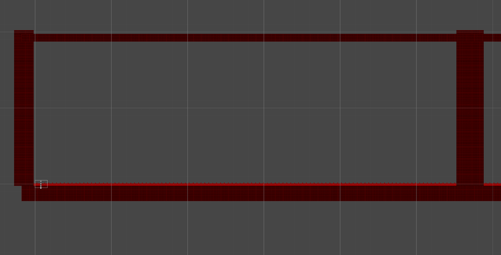 | The first level, this was used to test the control and handling of the vehicle.   |
| IntroStartButAimHigh (1x2) | 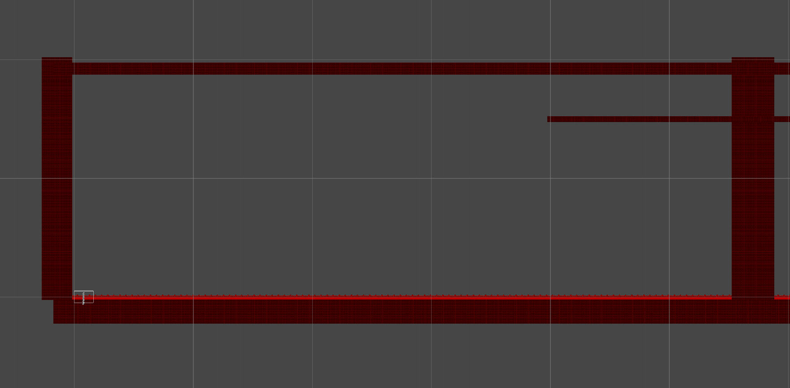 | Copy of the first, but added a height to reach and land to.   |
| Just Glide (1x3) | 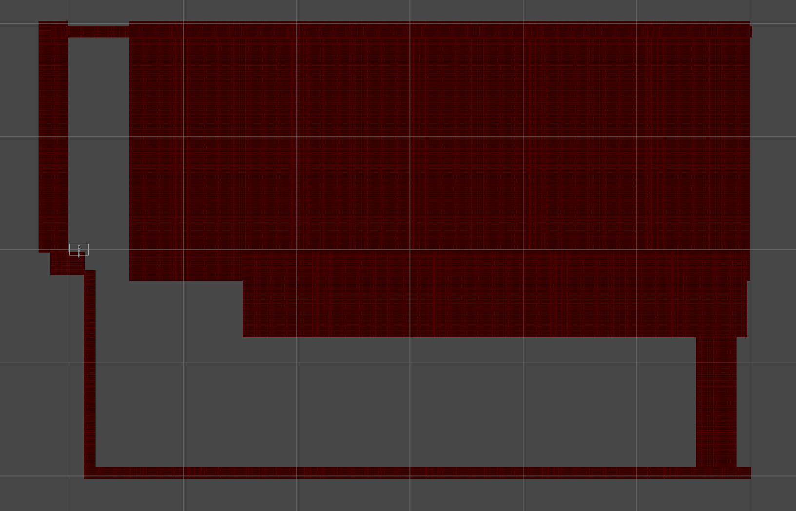 | The only level that went negative in height. Used a fair bit of resources.   |
| CGauntlet I (1x4) | 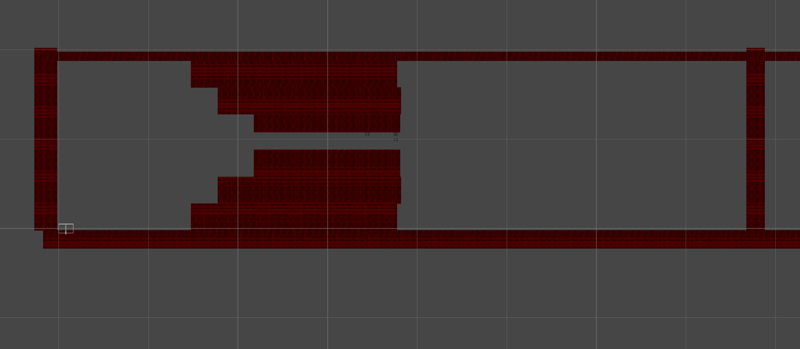 | Wanted this to be tough   |

### Section 2

| Level Name | Media | Description  |
| ------------- | ------------- | -- |
| Hop Skip And Jump (2x1) | 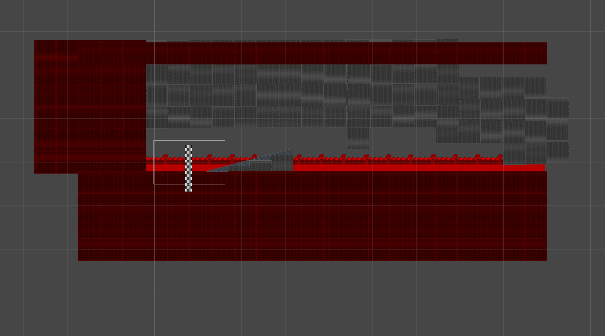 | This introduced the ramp objects. Very short level.   |
| Bumps and Bruises.. (2x2) | 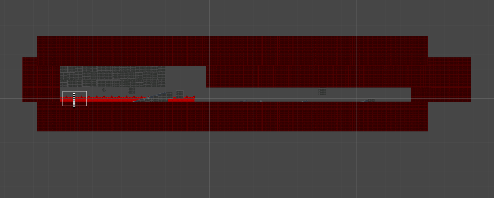 | Even more ramps but a bit longer.   |
| A Pipe Dream (2x3) | 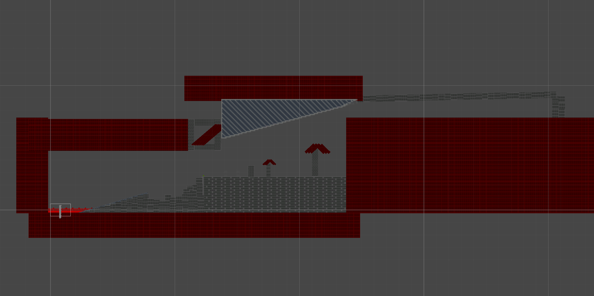 | Demo of this in the media folder. Was testing the rotation of the game objects stored in the resource folder.   |
| 30 60 90 ? (2x4) | 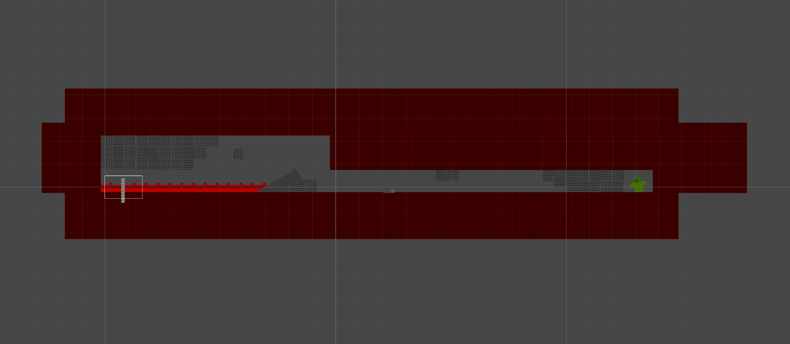 | Rotated game objects even more. And in a very narrow space to navigate.   |

### Section 3

#### Real section 3
| Level Name | Media | Description  |
| ------------- | ------------- | -- |
| Towerland I (3x1) | 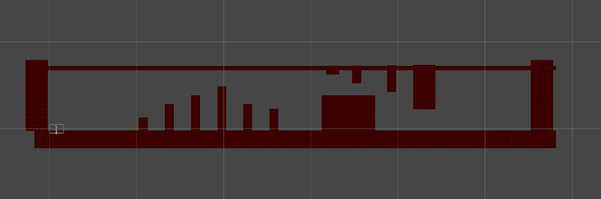 | This level set started off with the tower idea. This first level was somewhat ok. But the two removed ones really pushed it and were removed.   |
| TowerKick (3x2) | 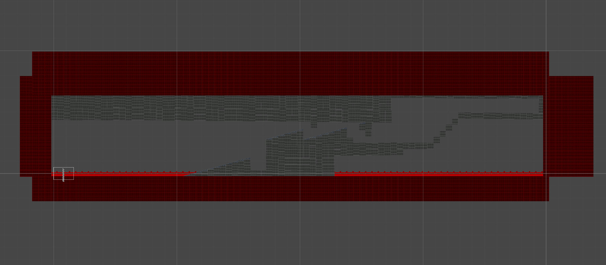 | Ramps and a few towers that may hit the player.   |
| Land Up (3x3) | 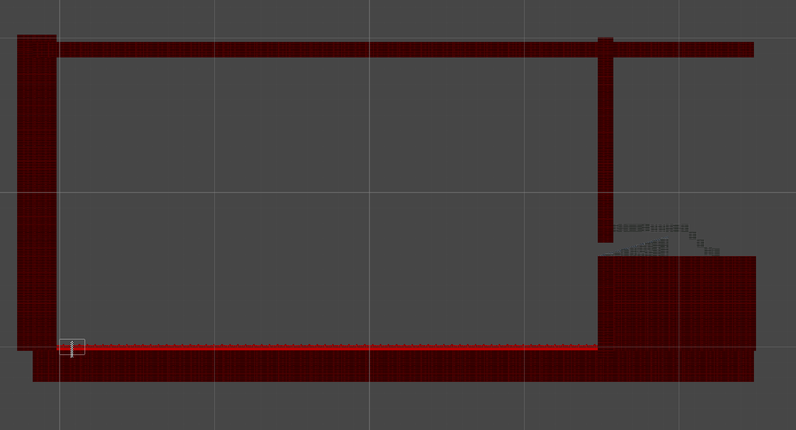 | Large map, but a small entrance. Need to use the metrics/map to help land in designated area.   |
| The Pile (3x4) | 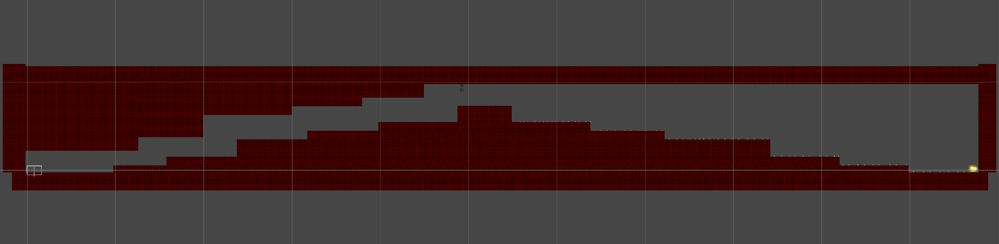 | This one was ok, guided the player. Just had to land at the top.   |

#### Removed section 3

| Level Name | Media | Description  |
| ------------- | ------------- | -- |
| Scandar I (3x2 removed) | 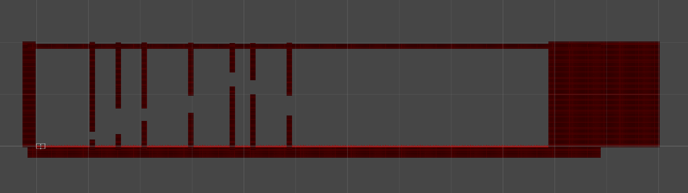 | 3x2 and 3x3 started off as one. But then split into two seperate levels because they were very long. And it became a memory game and less reactive.   |
| Scandar II (3x3 removed) | 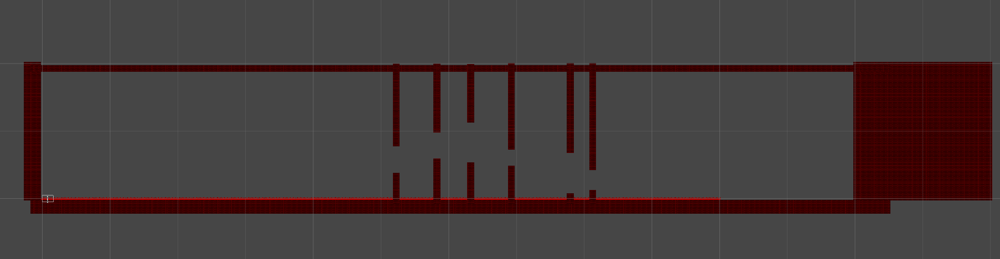 | I never finished play testing these levels, which was why I removed them. They were also not fun, and why I put in the level skip button. If these levels did not exist, no level skip button in UI.   |

### Section 4

| Level Name | Media | Description  |
| ------------- | ------------- | -- |
| kHouse=mK? (4x1) | 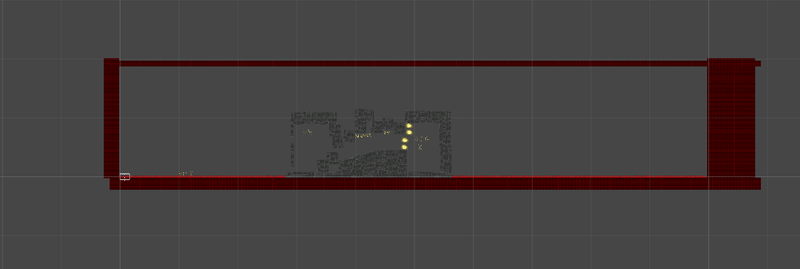 | The final sub set of levels. I was going with a theme here...   |
| eHouse=on the wire! (4x2) | 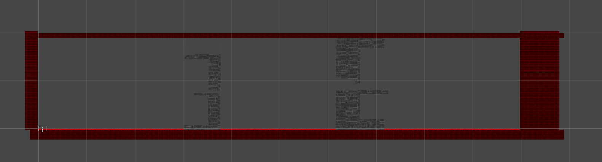 | Playing with letter on this one. The letter E.   |
| dHous-da house (4x3) | 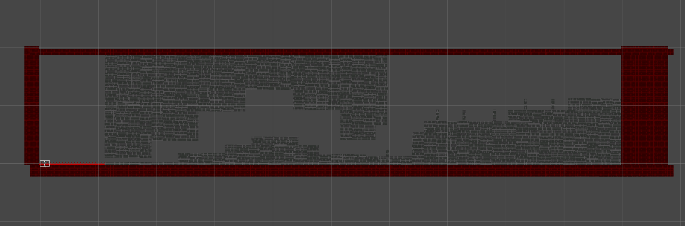 | This one is a flat letter d with some extra game objects for challenge. This one took a while to load in the editor due to the amount of gameobjects placed.   |
| A Proper House (4x4) | 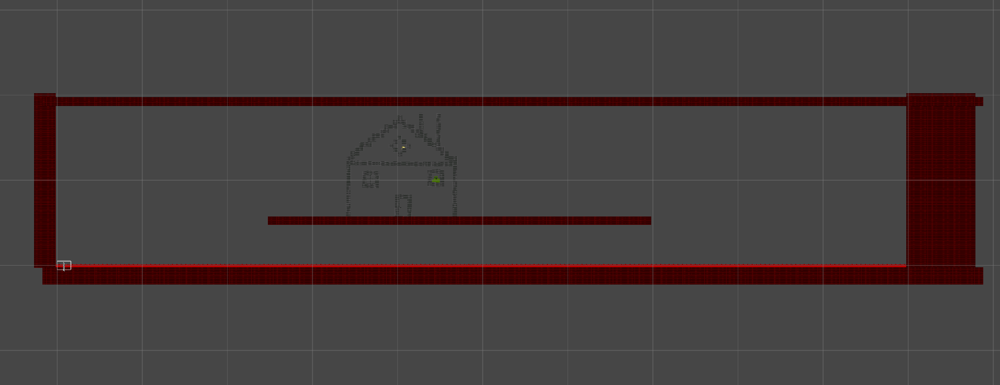 | Just a house, fly over and land     |

## Apendix

### Internal Scene Editor

This does not have a drag and drop method to install new levels. It has to be done in the editor if that even wants to be done.

Scene files are stored in (Assets\resources\scenes)There are two types, old style and new style. New style has the rotation/scale as a storable variable while old style does not. Both are compatible.
 
 Example below (old):

 \# Prefab,LayerOrder,StartX,EndX,StartY,EndY

ground/airport,0,0,1000,0,2.56

(new)

ground/gbrick,0,133.15,135.71,-0.009999998,2.55,4,4,0

New just adds new variables right after the existing system. The application checks for this. It was easier to use the Old style rather than new for manually placing objects.

### Unity Editor information

* 2020.3.16f1
* Visual Studio 2019 integration

